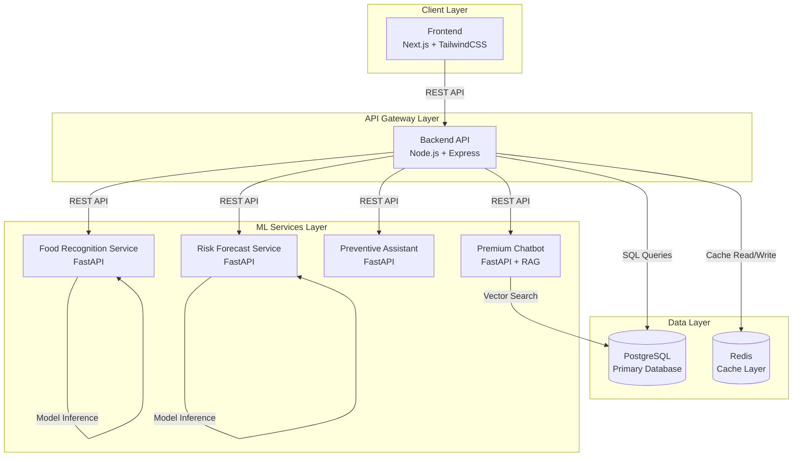

# HealthSphere System Architecture

## 1. High-Level System Architecture

### 1.1 Architecture Diagram (Mermaid)



### 1.2 ASCII Architecture Diagram

```
┌─────────────────────────────────────────────────────────────────┐
│                         CLIENT LAYER                             │
│                    ┌──────────────────┐                         │
│                    │   Frontend       │                         │
│                    │  Next.js + TS   │                         │
│                    │   TailwindCSS    │                         │
│                    └────────┬─────────┘                         │
└────────────────────────────┼─────────────────────────────────────┘
                             │ REST API (HTTPS)
                             │
┌────────────────────────────▼─────────────────────────────────────┐
│                      API GATEWAY LAYER                            │
│                    ┌──────────────────┐                         │
│                    │  Backend API     │                         │
│                    │ Node.js + Express│                         │
│                    │   TypeScript     │                         │
│                    └───┬──────────┬───┘                         │
│                        │          │                             │
│         ┌──────────────┼──────────┼──────────────┐             │
│         │              │          │              │             │
└─────────┼──────────────┼──────────┼──────────────┼─────────────┘
          │              │          │              │
    ┌─────▼─────┐  ┌─────▼─────┐  ┌─▼─────┐  ┌────▼─────┐
    │ PostgreSQL│  │   Redis   │  │  ML   │  │   ML     │
    │  Database │  │   Cache   │  │Services│  │ Services │
    └───────────┘  └───────────┘  └───────┘  └──────────┘
```

## 2. Component Explanations

### 2.1 Frontend (Next.js)

The frontend is a modern React application built with Next.js and TypeScript, providing a responsive user interface for HealthSphere. It uses TailwindCSS for styling and communicates with the backend API through REST endpoints. The frontend handles user authentication, displays workout recommendations, food recognition results, health risk forecasts, and provides access to the premium chatbot interface. It implements client-side routing, state management, and real-time updates for user progress and community challenges.

The frontend is designed as a single-page application (SPA) with server-side rendering capabilities for improved SEO and performance. It includes features such as image upload for food recognition, interactive charts for health metrics, and a chat interface for the premium assistant.

### 2.2 Backend API Gateway (Node.js + Express)

The backend serves as the central API gateway for the HealthSphere platform, handling all client requests and orchestrating communication between the frontend, ML services, and data layer. Built with Node.js and Express, it provides RESTful endpoints for authentication, workout management, food recognition, risk forecasting, and community features. The backend implements JWT-based authentication, request validation, error handling, and rate limiting.

It acts as a middleware layer that validates user requests, manages database transactions, implements caching strategies with Redis, and coordinates calls to ML microservices. The backend also handles file uploads for food images, processes them, and forwards them to the appropriate ML service for analysis. It maintains session state, manages user permissions, and enforces business logic rules.

### 2.3 ML Microservices (FastAPI)

The ML services layer consists of multiple specialized FastAPI microservices, each handling specific machine learning tasks. The Food Recognition Service processes uploaded food images using computer vision models to identify meals and estimate nutritional content. The Risk Forecast Service uses time-series analysis and predictive models to calculate health risk scores for the next 30 days based on user data.

The Preventive Assistant Service analyzes user health patterns and generates warnings and recommendations. The Premium Chatbot Service implements a RAG (Retrieval-Augmented Generation) pipeline, combining vector search over health knowledge bases with large language models to provide personalized health advice. All ML services are containerized, scalable, and communicate with the backend via REST APIs.

### 2.4 PostgreSQL Database

PostgreSQL serves as the primary relational database for HealthSphere, storing all persistent data including user profiles, workout logs, meal records, community challenges, risk scores, and chatbot usage statistics. The database is designed with proper normalization, foreign key constraints, and indexes for optimal query performance.

It maintains referential integrity between users and their associated data (workouts, meals, risk scores), supports complex queries for analytics and reporting, and provides ACID compliance for data consistency. The schema includes enums for chronic conditions and workout types, UUID primary keys for distributed system compatibility, and timestamps for audit trails.

### 2.5 Redis Cache

Redis provides an in-memory caching layer to improve application performance and reduce database load. It caches frequently accessed data such as user sessions, workout recommendations, risk forecasts, and community challenge leaderboards. Redis also stores JWT refresh tokens and implements rate limiting counters for API endpoints.

The cache layer reduces latency for read-heavy operations, stores temporary data like file upload tokens, and maintains session state for authenticated users. Cache invalidation strategies ensure data consistency when underlying data changes, with TTL (time-to-live) settings for automatic expiration of stale data.

### 2.6 Authentication Flow (JWT)

The authentication system uses JSON Web Tokens (JWT) for stateless authentication. When a user registers or logs in, the backend validates credentials against the database, generates a JWT access token (short-lived) and a refresh token (long-lived), and stores the refresh token in Redis. The access token is sent to the client and included in subsequent API requests.

The backend validates the JWT signature and expiration on each request, extracting user information from the token payload. When the access token expires, the client uses the refresh token to obtain a new access token. This approach eliminates the need for server-side session storage while maintaining security through token expiration and signature verification.

### 2.7 File Upload Flow (Food Images → ML Service → DB)

When a user uploads a food image, the frontend sends it to the backend's `/food/scan` endpoint as a multipart form-data request. The backend validates the file type and size, stores it temporarily, and forwards it to the Food Recognition ML Service via a REST API call. The ML service processes the image using a trained model, returning predictions including meal label, estimated calories, sodium, sugar, and an unhealthy score.

The backend receives the ML service response, stores the meal record in PostgreSQL with the user ID and nutritional data, and returns the results to the frontend. The frontend updates the UI to display the recognized food and nutritional information. The entire flow is asynchronous, with the backend handling errors and providing appropriate feedback to the user.

### 2.8 Premium Chatbot Flow (ML Service + RAG Pipeline)

The premium chatbot implements a RAG (Retrieval-Augmented Generation) pipeline for context-aware health advice. When a user submits a query, the backend forwards it to the Chatbot ML Service along with the user's health profile. The ML service first performs a vector search over a knowledge base of health information, retrieving relevant context documents.

The retrieved context, along with the user's health history and the query, is sent to a large language model (LLM) for generation. The LLM produces a personalized response that incorporates both the retrieved knowledge and the user's specific health data. The response is returned to the backend, which logs the interaction, updates usage statistics, and sends the answer to the frontend. The RAG approach ensures responses are grounded in accurate health information while being personalized to each user.

## 3. Inter-Service Communication Flow

### 3.1 REST Communication Patterns

**Frontend ↔ Backend:**
- All communication uses HTTPS REST APIs
- JSON payloads for request/response bodies
- JWT tokens in Authorization headers
- Standard HTTP status codes (200, 201, 400, 401, 404, 500)

**Backend ↔ ML Services:**
- REST APIs over HTTP/HTTPS
- JSON for structured data, multipart/form-data for file uploads
- Request timeouts and retry logic for resilience
- Service discovery through environment variables or service registry

### 3.2 Database Connections

- Backend maintains connection pools to PostgreSQL
- Connection pooling reduces overhead and improves performance
- Transactions ensure data consistency for multi-step operations
- Read replicas can be used for scaling read operations

### 3.3 Redis Caching Logic

- Cache-aside pattern: Check cache first, if miss, query DB and update cache
- Write-through for critical data: Write to both DB and cache
- TTL-based expiration for time-sensitive data
- Cache invalidation on data updates

### 3.4 Event Flow Diagrams

#### User Uploads Meal Flow

```
1. User uploads image → Frontend
2. Frontend → POST /food/scan (with image) → Backend
3. Backend validates file → Stores temporarily
4. Backend → POST /recognize (image) → ML Food Service
5. ML Service processes image → Returns predictions
6. Backend → INSERT meal record → PostgreSQL
7. Backend → Cache meal history → Redis
8. Backend → Returns results → Frontend
9. Frontend updates UI with meal info
```

#### ML Predicts Risk Flow

```
1. User requests forecast → Frontend
2. Frontend → GET /risk/forecast → Backend
3. Backend checks Redis cache for recent forecast
4. If cache miss:
   a. Backend → GET user data → PostgreSQL
   b. Backend → POST /forecast (user data) → ML Risk Service
   c. ML Service runs prediction model → Returns risk score
   d. Backend → INSERT risk_score → PostgreSQL
   e. Backend → Cache result → Redis
5. Backend → Returns forecast → Frontend
6. Frontend displays risk visualization
```

#### Premium Chatbot Query Flow

```
1. User submits query → Frontend
2. Frontend → POST /chatbot/query → Backend
3. Backend validates premium status → Checks user subscription
4. Backend → GET user health profile → PostgreSQL
5. Backend → POST /chat (query + profile) → ML Chatbot Service
6. ML Service:
   a. Performs vector search → Retrieves relevant context
   b. Generates response using LLM with context
   c. Returns personalized answer
7. Backend → INSERT chatbot_usage → PostgreSQL
8. Backend → Returns response → Frontend
9. Frontend displays chat message
```

#### Workout Recommendation Flow

```
1. User requests recommendations → Frontend
2. Frontend → GET /workouts/recommend → Backend
3. Backend checks Redis cache for user preferences
4. Backend → GET user profile + history → PostgreSQL
5. Backend applies recommendation algorithm (or calls ML service)
6. Backend → Returns workout suggestions → Frontend
7. Frontend displays workout cards
8. User logs workout → Frontend → POST /workouts/log → Backend
9. Backend → INSERT workout → PostgreSQL
10. Backend → Invalidate cache → Redis
11. Backend → Returns confirmation → Frontend
```

## 4. Security Considerations

- All API communications use HTTPS
- JWT tokens are signed and have expiration times
- Passwords are hashed using bcrypt
- File uploads are validated for type and size
- Rate limiting prevents abuse
- CORS policies restrict frontend origins
- SQL injection prevention through parameterized queries
- Input validation on all endpoints

## 5. Scalability Considerations

- ML services can be horizontally scaled
- Database read replicas for scaling reads
- Redis cluster for distributed caching
- Load balancers for backend API
- CDN for static frontend assets
- Message queues for async processing (future enhancement)

